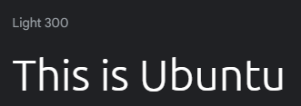

# Quizzical

Quizzical is a simple, straightforward quiz game for anyone seeking a challenge. It's easy on the eye but not so easy on the mind, and its diverse range of questions is sure to leave its users guessing. From acclaimed novels to cherished childhood toys to Greek mythology, there's something for everyone.

 

## User Stories

- **As a novice**, I'm looking for a quiz that stimulates my mind but isn't too difficult. Otherwise, I might not feel compelled to answer all the questions.

- **As a seasoned quiz-taker**, I'm looking for something unique but not for novelty. Essentially, I want a quiz that challenges me, but I don't want it to feel impossible.

- **As a quiz master**, I've seen it all before. I don't want a quiz that's easy to win. I want to be pushed to the point of perspiration and to win on my own terms.

## Features Overview

For anyone looking for light entertainment, Quizzical can adequately serve their needs. It's a no-nonsense quiz game that has been designed with tone, aesthetics, and most prominently, light sensitivity in mind. Those who would like to play the quiz can navigate through it at their own pace and will receive immediate feedback as to whether or not they've answered a question correctly. Once they've completed it, their result will be displayed accordingly.

### Current Features

- Landing Page
    - Upon arrival to the first page, would-be players are met with lazily swinging lightbulbs and an accordingly composed theme. Ultimately, it was designed with tranquility in mind, thus making it easy on the eyes and gentle on the mind.

    #### Small Version
    
    
    #### Large Version
    

- Quiz Page
    - After clicking the 'Go to Quiz' button, users will land on the second page - this is where the quiz takes place. Its simple design has been composed as such to avoid unnecesary distractions and to thereby reduce cognitive load. If a correct answer is registered, it will be highlighted in green, and the score will be incremented by 1. If an answer is incorrect, it will be highlighted in red. When the 'Next' button is clicked, the question number will be incremented by 1, and a new question will appear. 

    #### Small Version
    
    
    #### Large Version
    

- Result Page
    - On the third and final page, users are informed that the quiz has been completed and their final score is displayed. If they scored 8 points or more, a congratulatory message is displayed. On the other hand, if they lose, a commiseration message is displayed. In the event that they would like to reset the game, they can click the 'Start Again' button; doing so will return them to the landing page.

    #### Small Version - WIN
    
    
    #### Large Version - WIN
    

    #### Small Version - LOSE
    
    
    #### Large Version - LOSE
    

### Prospective Features (TBD)

- Enable users to progress through the quiz using arrow buttons.
- Provide users with an option to switch between light and dark modes.

## Quiz Rules

Beginning on the first page, the 'Go to Quiz' button must be clicked in order for the quiz to start. On the second page, 1 of 4 answers must be selected. Once an answer button has been clicked, its colour will change to either green or red - the former indicates a correct answer, and the latter signals an incorrect answer. Moving on to the next question requires the player to click the 'Next' button. For a player to win, they must answer 8 or more questions correctly; they will otherwise lose. If they would like to play again, they can elect to do so at the end.

## Quiz Flow

Prior to writing the quiz script, the below flowchart was produced in order to ensure clear and precise logic.

## Development Challenges

Compared with project 1, the HTML and CSS code was much easier to implement due to increased syntax familiarity, and despite some typical flexbox styling issues, it all came together in the end. Having said that, writing the JavaScript program proved much more challenging - not least due to narrow time constraints.

### Storing, accessing and utilising the questions and answers

From the outset, I knew that I would need to place the questions and answers into an array or two, but I wasn't sure entirely about the implementation side of things. It was during a conversation with my mentor - Spencer Barriball - that I happened upon a solution. Luckily for me, he had created a quiz and offered to show it to me. It was then that I decided to follow in his footsteps and place my questions and answers into objects within an array. Additionally, as in Spencer's script, I added a third property for correct answers. I then added an index to each answer within my HTML code, assigned the indexes for each correct answer to the 'correct' property within each object, and Bob's your uncle!

### Adhering to the DRY principle

After retreiving the necessary elements from the DOM and finding a storage space for my quiz content, I began writing my first function. In order to start the quiz, it was necessary to hide the Landing page and display the Quiz page; this included the first question, its corresponding number, and all possible answers. Accordingly, I created a 'Go to Quiz' function which incorporated the latter mentioned elements. As I progressed through the script, it became apparent that the starting conditions were needed in more than one place (three in the end) and that it was necessary to create a function which could be called in lieu of repeating the code block in question. Thus, the 'init' - meaning initial - function was born!

### Preventing further answer attempts

Once an answer has been selected, users shouldn't be able to click any further answers - or so I thought. During testing, I was able to apply a green colour to the correct answers and a red colour to those that were incorrect; I certainly hadn't anticipated that it would be possible to keep clicking and cause all the buttons to light up like a Christmas tree. In light of that, it was evident that a solution was needed in order to prevent further answer attempts. By creating a function that would remove the event listener for each button, and inserting it into another function, I solved the problem.

### Defining what happens when an answer is selected

Speaking of other functions, users wouldn't be able to submit their answers without this next one: the aptly named 'User Answers Question' function. It listens for a click, retrieves the index of the question (which corresponds to the index assigned to the 'correct' property within the 'Question and Answers' array) and converts it from a string to an integer. It then compares the index of the selected answer with the value in the previously mentioned array and executes the applicable code block, the output of which was described in the 'Current Features' section above.

### Moving onto the next question

Once a question has been answered, users will (hopefully) want to move onto the next one - that's where the 'Next Question' function comes into play. As one might expect, an event listener waits for a user to click 'Next' and triggers the execution of its attached function accordingly. It starts by incrementing the 'questionIndex' and 'answerIndex' variables by 1, and it then leads to an 'if/else' statement. If the question number is strictly equal to 10, the nested if/else statement will be executed and the Result page will be displayed. If not, the quiz will continue until 10 questions have been answered.

### Resetting the game

Last but not least, the 'Reset Game' function takes its turn in the spotlight. If a user doesn't like their score, they'll have an opportunity to start the quiz again. In order to do that, they must click the 'Start Again' button. If they do, the question, score and answer counters will be reset to 0; the background colour of the buttons will be restored; the Result page will be hidden; the Landing page will become visible; the score and question display will be reset; and the 'init' function will be called. When all conditions have been restored, users will be returned to the first page where they can begin anew.

N.B. As difficult as it's been to wrap my head around JavaScript, I've thoroughly enjoyed the learning process and look forward further to developing my skills.

## Testing

- ### Landing Page

    - While viewing the landing page in its various orientations, I observed that the content was displayed towards the top of the page which was aesthetically displeasing. As the issue was present across all three pages, I addressed the issue by styling the <main> element with a margin-top property.

    #### Positioning Issue

    ![Landing Page Screenshot [1])](assets/images/home-positioning-issue.png)
    ![Quiz Page Screenshot [1])](assets/images/quiz-positioning-issue.png)
    ![Result Page Screenshot [1])](assets/images/result-positioning-issue.png)

    ### Contrast Issue

    - While viewing the landing page in its various orientations, I identified a contrast issue between the main heading and the background. As the issue was present at all screen sizes, I adjusted both the general and media screen styles.

- ### Quiz Page

    - While progressing through the quiz questions, it became apparent that some of the content didn't fit into the 
 and <button> elements, and some of the font sizes weren't correct. By adjusting the CSS properties of the latter mentioned elements, I rectified both issues.

    #### Content Sizing Issue

    ![Quiz Page Screenshot [2])](assets/images/quiz-sizing-issue.png)

- ### Result Page

    - While viewing the result page, I recognised a need to change the animation on the last page according to the final score. Previously, a 'star' animation would be displayed indiscriminately (see below).

    ![Result Page Screenshot [2])](assets/images/result-page-small.png)
    ![Result Page Screenshot [3])](assets/images/result-page-large.png)

    After adjusting the HTML and JavaScript code, respectively, the 'star' animation will be displayed if a user wins, and a 'you lose' animation will be displayed if they lose. I decided to make this change as a means of further differentiating between the two possible outcomes of the quiz.

    ![Result Page Screenshot [4])](assets/images/result-page-win-small.png)
    ![Result Page Screenshot [5])](assets/images/result-page-win-large.png)
    ![Result Page Screenshot [6])](assets/images/result-page-lose-small.png)
    ![Result Page Screenshot [7])](assets/images/result-page-lose-large.png)

## Validator Testing

- ###  HTML
   - While testing the HTML code with the [W3 Validator](https://validator.w3.org/nu), several results were returned.

        1. *Error: Bad value 100% for attribute height on element video: Expected a digit but saw % instead.*
            - Considering I didn't intend for any of the videos to take up all available space within their containing 
 elements, height and width properties should not have been set to 100%; in fact, they're entirely unneccessary.
        2. *Error: Attribute alt not allowed on element source at this point.*
            - Typically, 'alt' attributes are used to provide text for images in the event that they aren't displayed correctly in the browser, whereas applying them to videos is not standard practice. A type attribute has already been placed, the value assigned to which informs te browser as to how the file type ought to be handled.

        ~ Both errors have now been rectified.

        

- ### CSS
   - No issues were found after passing the CSS code through [W3's Jigsaw Validator](https://jigsaw.w3.org-validator).

   

- ### Unfixed Bugs
    - As far as I was able to observe, there were no outstanding bugs to be fixed.

## Deployment

Quizzical was deployed to GitHub pages using the following steps:

1. Navigate to the **Quizzical** [repository](https://github.com/c-hut/quizzical/tree/main) on Github
2. Click **Settings** (last button on the header, directly above the repo)
3. On the left-hand side, find **Pages** (directly below **Codespaces**)
4. Find **Source** under **Build and deployment**; click the dropdown menu; and select **Deploy from a branch**
5. Find **Branch**; click the dropdown menu; select **main**; and set the folder to **root**
6. As per the succeeding instructions, wait and then refresh the repository. If all steps have been followed correctly, there should be a box that says: "your site is live at https://username.github.io/site-name/"

As a result of following these steps, my website was deployed. It can be viewed [here](https://c-hut.github.io/quizzical).

## Credits

### Acknowledgements
- I would like to thank my personal mentor: Spencer Barriball. From the outset, he was exceptionally kind and knowledgable. Whenever I experienced an issue, he endeavoured to aid me in finding a timely resolution. He's a credit to his profession.

- I would also like to thank Jonas Schmedtmann for creating [The Complete JavaScript Course 2024: From Zero to Expert!](https://www.udemy.com/course/the-complete-javascript-course/). I couldn't have completed this project without it.

### Code Inspiration and Support

- Spencer's 'question and answer' array

    ~ featured in a simple quiz that Spencer developed for educational purposes

- ChatGPT aided me in breaking down and understanding key JavaScript concepts

    ~ this is a prime example of how I used ChatGPT to enhance my learning experience

### Media

- [Favicon.io](https://favicon.io/favicon-generator) was used to select the Favicon icon for the browser tab.

    

- [Coolers](https://coolors.co) was used to generate a colour palette.

    
    

- [Google Fonts](https://fonts.google.com) was used to generate font styles.

    - Nanum Gothic

    
    
    - Ubuntu

    

    - Leckerli One

    

    - Roboto

    

- [Vecteezy](https://www.vecteezy.com) was used to find suitable videos.

    - Home page video

     / [Link to video](https://www.vecteezy.com/video/1787130-two-classic-light-bulbs-glowing-and-swinging-in-darkness-in-4k)

    - Result page videos

     / [Link to video](https://www.vecteezy.com/video/8808619-star-particle-effect)

     / [Link to video](https://www.vecteezy.com/video/3538961-you-lose-colorful-text-word-flicker-light-animation)

- [HTML Color Codes](https://htmlcolorcodes.com) was used to find HEX and RGBA colour codes.

- [Rapid Tables](https://htmlcolorcodes.com) was used for colour code conversion.

- [CSS Gradient](https:/gradient.io) was used to create colour gradients and to source different shades of red.

- [CSS Tricks](https:/-tricks.com) was used for the following two purposes:

    - [Flexbox refresher](https:/-tricks.com/snippets/a-guide-to-flexbox/#aa-background).
    - [Positioning refresher](https:/-tricks.com/absolute-relative-fixed-positioining-how-do-they-differ).

- [Cloud Convert](https://cloudconvert.com) was used for video conversion (mov to mp4).

- [Veed](https://www.veed.io) was used for video compression.

- [Teen Vogue Article](https://www.teenvogue.com/story/131-best-trivia-questions-and-answers-to-stump-your-friends-with) was used to source ten varied quiz questions.

- [Markdown Guide](https://www.markdownguide.org/cheat-sheet) was used to refresh knowledge on how to write a README.md file.

- [Am I Responsive?](https://ui.dev/amiresponsive) was used to generate the opening screenshot.